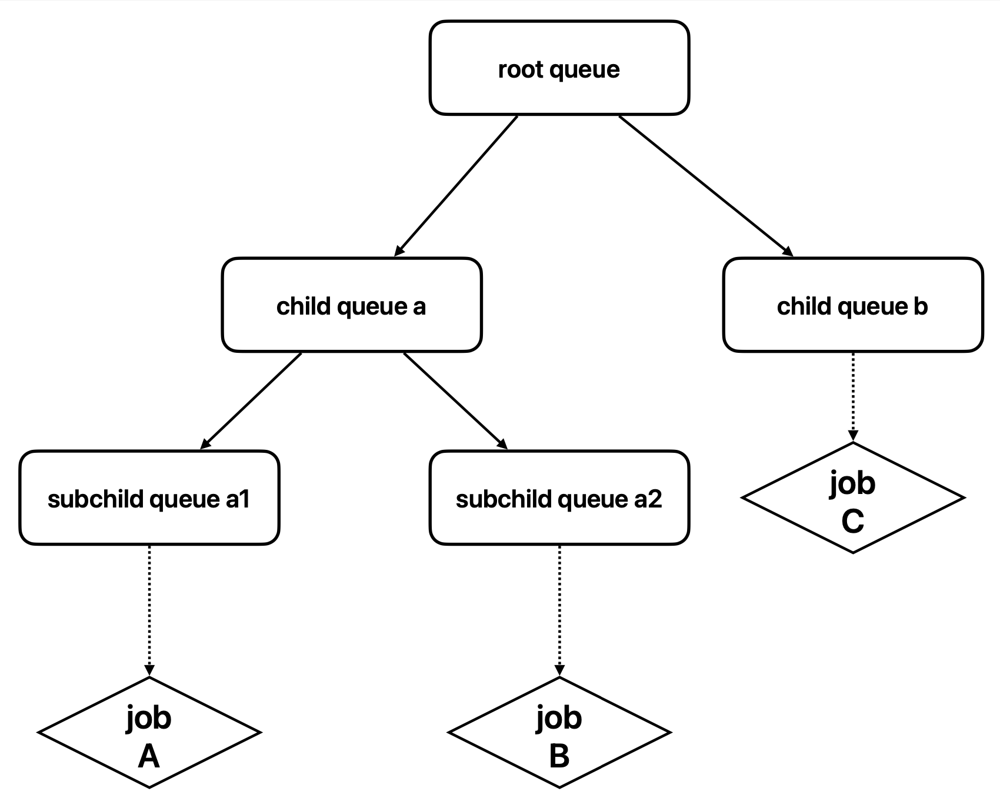

# 层级队列

## 背景

在多租户场景中, 队列是实现公平调度、资源隔离和任务优先级控制的核心机制. 然而, 在目前的 Volcano 中, 队列仅支持平级结构, 缺乏层级概念. 而在实际应用中, 不同队列往往隶属于不同部门, 部门之间存在层级关系, 对资源的分配和抢占需求也更为精细. 为此, Volcano latest 版本引入了层级队列功能, 大幅增强了队列的能力. 通过这一功能, 用户可以在层级队列的基础上实现更细粒度的资源配额管理和抢占策略, 构建更高效的统一调度平台.

对于使用 YARN 的用户, 可以使用 Volcano 无缝将大数据业务迁移到 Kubernetes 集群之上. YARN 的 Capacity Scheduler 已经具备层级队列功能, 支持跨层级的资源分配和抢占, 而 Volcano latest 版本采用类似的层级队列设计, 提供更灵活的资源管理和调度策略.

## 功能支持

- 支持配置队列层级关系

- 支持跨层级队列任务间资源共享与回收

- 支持为每个维度的资源设置队列容量上限 `capability`, 资源应得量 `deserved` (若队列已分配资源量超过设置的 `deserved` 值, 则队列中的资源可被回收), 资源预留量 `guarantee` (当前队列预留资源, 无法与其他队列共享)

## 使用指南

### 调度器配置

在新版本中, 层级队列能力基于 `capacity` 插件构建, 调度器配置需要打开 `capacity` 插件, 并且将 `enableHierarchy` 设置为 true, 同时需要打开 `reclaim` action, 支持队列间的资源回收, 调度器配置示例如下所示:

```yaml
kind: ConfigMap
apiVersion: v1
metadata:
  name: volcano-scheduler-configmap
  namespace: volcano-system
data:
  volcano-scheduler.conf: |
    actions: "allocate, preempt, reclaim"
    tiers:
    - plugins:
      - name: priority
      - name: gang
        enablePreemptable: false
    - plugins:
      - name: drf
        enablePreemptable: false
      - name: predicates
      - name: capacity # capacity 插件必须打开
        enableHierarchy: true # 开启层级队列
      - name: nodeorder
```

### 构建层级队列

Queue spec 中新增了 parent 属性, 可以用来指定队列所属的父队列:

```go
type QueueSpec struct {
    ...
    // Parent define the parent of queue
    // +optional
    Parent string `json:"parent,omitempty" protobuf:"bytes,8,opt,name=parent"`
    ...
}
```

Volcano Scheduler 在启动后会默认创建一个 root 队列, 作为所有队列的根队列, 用户可以基于 root 队列进一步构建层级队列树, 如构建这样一个树结构:



```yaml
# child-queue-a 的父队列为 root 队列
apiVersion: scheduling.volcano.sh/v1beta1
kind: Queue
metadata:
  name: child-queue-a
spec:
  reclaimable: true
  parent: root
  deserved:
    cpu: 64
    memory: 128Gi
---

# child-queue-b 的父队列为 root 队列
apiVersion: scheduling.volcano.sh/v1beta1
kind: Queue
metadata:
  name: child-queue-b
spec:
  reclaimable: true
  parent: root
  deserved:
    cpu: 64
    memory: 128Gi
---

# subchild-queue-a1 的父队列为 child-queue-a 队列
apiVersion: scheduling.volcano.sh/v1beta1
kind: Queue
metadata:
  name: subchild-queue-a1
spec:
  reclaimable: true
  parent: child-queue-a
  # 可根据需要设置 deserved, 队列已分配资源若已超过 deserved 值, 则队列中任务可被抢占
  deserved:
    cpu: 32
    memory: 64Gi
---

# subchild-queue-a2 的父队列为 child-queue-a 队列
apiVersion: scheduling.volcano.sh/v1beta1
kind: Queue
metadata:
  name: subchild-queue-a2
spec:
  reclaimable: true
  parent: child-queue-a
  # 可根据需要设置 deserved, 队列已分配资源若已超过 deserved 值, 则队列中任务可被抢占
  deserved:
    cpu: 32
    memory: 64Gi
---

# 提交一个示例 vc-job 到叶子队列 subchild-queue-a1 中
apiVersion: batch.volcano.sh/v1alpha1
kind: Job
metadata:
  name: job-a
spec:
  queue: subchild-queue-a1
  schedulerName: volcano
  minAvailable: 1
  tasks:
    - replicas: 1
      name: test
      template:
        spec:
          containers:
            - image: alpine
              command: ["/bin/sh", "-c", "sleep 1000"]
              imagePullPolicy: IfNotPresent
              name: alpine
              resources:
                requests:
                  cpu: "1"
                  memory: 2Gi
```

当集群资源不够 pod 部署时, pod 所占资源可以被抢占, 对于不同队列的 pod, 将优先抢占兄弟队列中的 Pod(若兄弟队列中的已分配资源量已超过 `deserved` 值), 若兄弟队列中的资源不足以满足 Pod 的需求, 那么就按照队列的层级结构(即祖先队列)逐层向上查找资源, 直到找到足够的资源为止. 如图中, job-a 和 job-c 先提交, 集群资源不够满足 job-b 要求, 则 job-b 会优先抢占 job-a, 若抢占 job-a 后资源仍得不到满足, 则会再考虑抢占 job-c.

需要注意的是, 目前版本用户只能在**叶子队列**提交作业, 且如果已有任务提交到了父队列中, 则不能在该队列下创建子队列, 这确保了队列层次结构中不同层级的资源和任务的有效管理. 同时需要注意的是, 子队列的 `deserved/guarantee` 总和不能超过父队列配置的 `deserved/guarantee` 值, 每个子队列的 `capability` 值不能超过父队列的 `capability` 限制. 如果某个队列未设置某一维度资源的 `capability` 值, 则该维度的 `capability` 将继承自其父队列的设置, 如果父队列及其所有祖先队列均未设置, 则最终继承自根队列的配置. 根队列的 `capability` 默认设置为集群中该维度资源的全部可用量.
