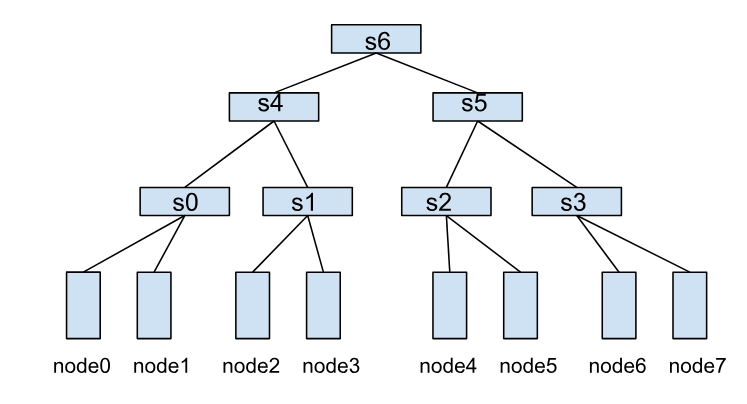

# 网络拓扑感知调度

## 背景

在 AI 大模型训练场景中, 模型并行(Model Parallelism)将模型分割到多个节点上, 训练过程中这些节点需要频繁进行大量数据交互. 此时, 节点间的网络传输性能往往成为训练的瓶颈, 显著影响训练效率. 数据中心的网络类型多样(如 IB、RoCE、NVSwitch 等), 且网络拓扑复杂, 通常包含多层交换机. 两个节点间跨的交换机越少, 通信延迟越低, 吞吐量越高. 因此, 用户希望将工作负载调度到具有最高吞吐量和最低延迟的最佳性能域, 尽可能减少跨交换机的通信, 以加速数据交换, 提升训练效率.

为此, Volcano提出了**网络拓扑感知调度(Network Topology Aware Scheduling)**策略, 通过统一的网络拓扑 API 和智能调度策略, 解决大规模数据中心 AI 训练任务的网络通信性能问题.

## 功能

#### 统一的网络拓扑 API: 精准表达网络结构

为了屏蔽数据中心网络类型的差异, Volcano 定义了新的 CRD [HyperNode](https://github.com/volcano-sh/apis/blob/network-topology-dev/pkg/apis/topology/v1alpha1/hypernode_types.go)来表示网络拓扑, 提供了标准化的 API 接口. 与传统的通过节点标签(label)表示网络拓扑的方式相比, HyperNode 具有以下优势:

- 语义统一: HyperNode 提供了标准化的网络拓扑描述方式, 避免了标签方式的语义不一致问题.
- 层级结构: HyperNode 支持树状层级结构, 能够更精确地表达实际的网络拓扑.
- 易于管理: 集群管理员可以手动创建 HyperNode, 或通过网络拓扑自动发现工具维护 HyperNode.

一个 HyperNode 表示一个网络拓扑性能域, 通常映射到一个交换机或者 Tor. 多个 HyperNode 通过层级连接, 形成树状结构. 例如, 下图展示了由多个 HyperNode 构成的网络拓扑:



- 叶子 HyperNode(s0、s1、s2、s3): 子节点类型为集群中的真实节点.
- 非叶子 HyperNode(s4、s5、s6): 子节点类型为其他 HyperNode.

在这种结构中, 节点间的通信效率取决于它们之间的 HyperNode 层级跨度. 例如:

- node0 和 node1 同属于 s0, 通信效率最高.
- node1 和 node2 需要跨两层 HyperNode(s0 → s4 → s1), 通信效率较低.
- node0 和 node4 需要跨三层 HyperNode(s0 → s4 → s6 → s5 → s2), 通信效率最差.

##### 关键字段

- spec.tier: 表示 HyperNode 的层级, 层级越低, 则该 HyperNode 内的节点通信效率越高.

- spec.members: HyperNode 下面的一组子节点, 可以通过 selector 来匹配关联的子节点.

- spec.members[i].type: 子节点的类型, 支持 `Node` 和 `HyperNode` 两种, 子节点全部为 `Node` 时, 代表当前 HyperNode 为叶子节点, 子节点全部为 `HyperNode` 时, 代表当前节点为非叶子 HyperNode.

- spec.members[i].selector: 子节点选择器, 支持 `exactMatch`, `regexMatch`, 和 `labelMatch` 三种 selector.

  - `exactMatch` 表示精确匹配, 子节点需要填写完整的 HyperNode 或者 Node 的 name,

  - `regexMatch` 表示的是正则匹配, 与正则表达式匹配的 Node 都会被当做当前 HyperNode 的子节点.

  - `labelMatch` 表示的是按标签匹配, 带有对应标签的节点都会被当做当前 HyperNode 的子节点, 配置示例如:

    ```yaml
    labelMatch:
      matchLabels:
        topology-rack: rack-1
    ```

> 注意: regexMatch/labelMatch 只能用在叶子 HyperNode 中, 用来匹配集群中的真实节点, 也就是说当 spec.members[i].selector.type 为 HyperNode 时, 不支持 regexMatch/labelMatch.

#### 基于网络拓扑的感知调度策略

Volcano Job 和 PodGroup 可以通过 `networkTopology` 字段设置作业的拓扑约束, 支持以下配置:

- mode: 支持 `hard` 和 `soft` 两种模式.

  - `hard`: 硬约束, 作业内的任务必须部署在同一个 HyperNode 内.

  - `soft`: 软约束, 尽可能将作业部署在同一个 HyperNode 下.

- highestTierAllowed: 与 `hard` 模式配合使用, 表示作业允许跨到哪层 HyperNode 部署, soft 模式下无需配置该字段.

例如, 以下配置表示作业只能部署在 2 层及以下的 HyperNode 内, 如 s4 和 s5, 以及更低层的 tier: s4 和 s5 的子节点 s0, s1, s2, s3, 否则作业将处于 Pending 状态:

```yaml
spec:
  networkTopology:
    mode: hard
    highestTierAllowed: 2
```

通过这种调度策略, 用户可以精确控制作业的网络拓扑约束, 确保作业在满足条件的最佳性能域运行, 从而显著提升训练效率.

#### HyperNode 自动发现: 简化网络拓扑管理

为进一步降低网络拓扑信息的管理负担, Volcano 提供了 HyperNode 自动发现功能. 该功能能够自动发现集群内的网络拓扑结构, 并根据发现结果自动创建、更新或删除相应的 HyperNode 自定义资源(CRs).

自动发现功能具有以下核心优势:

- 自动化管理: 自动从多种数据源(如 UFM、RoCE 或节点标签)发现和维护 HyperNode 信息, 无需手动维护.

- 实时同步: 定期同步网络拓扑变化, 确保 HyperNode 信息与实际网络状态保持一致.

- 可扩展架构: 支持可插拔的 Discoverer 组件, 用户可针对特定的网络管理工具开发自定义发现逻辑.

通过这一自动化发现机制, 用户可以专注于作业调度配置, 无需担心 HyperNode 创建和维护的复杂性, 显著简化了网络拓扑感知调度的部署和管理.

## 使用指导

### 安装 Volcano

Volcano 支持以下两种安装方式:

#### 通过 Helm 安装(推荐)

```bash
helm repo add volcano-sh https://volcano-sh.github.io/helm-charts
helm repo update
helm install volcano volcano-sh/volcano -n volcano-system --create-namespace --version 1.12.0
```

#### 使用 YAML 文件安装

```bash
kubectl apply -f https://raw.githubusercontent.com/volcano-sh/volcano/refs/heads/network-topology/installer/volcano-development.yaml
```

### 配置 Volcano 调度器

要启用网络拓扑感知调度功能, 需要修改 Volcano 调度器的配置文件. 以下是一个配置示例, 其中同时启用了 `network-topology-aware` 和 `binpack` 插件, 开启 `binpack` 更有助于实现更紧凑的任务调度:

```yaml
kind: ConfigMap
apiVersion: v1
metadata:
  name: volcano-scheduler-configmap
  namespace: volcano-system
data:
  volcano-scheduler.conf: |
    actions: "enqueue, allocate, backfill"
    tiers:
    - plugins:
      - name: priority
      - name: gang
    - plugins:
      - name: predicates
      - name: proportion
      - name: nodeorder
      - name: binpack # 启用 binpack 插件, 有助于任务的紧凑调度
      # arguments: # 用来配置 binpack 插件中各项资源的权重以及 binpack 插件自身的权重
      #   binpack.weight: 10 # binpack 插件的权重, 影响 binpack 策略的整体得分
      #   binpack.cpu: 5 # CPU 资源的权重, 权重越高, CPU 资源在打分时的占比越大
      #   binpack.memory: 1 # Memory 资源的权重
      #   binpack.resources: nvidia.com/gpu # 指定额外资源类型, 如 GPU
      #   binpack.resources.nvidia.com/gpu: 2 # GPU 的权重
      - name: network-topology-aware # 开启 network-topology-aware 插件
      # arguments:
      #   weight: 10 # 可以选择设置 network-topology-aware 的打分权重, 默认 weight 为 1

```

### HyperNode CRs 管理

HyperNode CRs 可以通过自动发现或手动创建两种方式进行管理.

#### HyperNode 自动发现(推荐)

Volcano 通过集成可插拔的网络拓扑发现工具(Discoverer)实现 HyperNode 的自动发现与管理. Discoverer 负责定期从外部网络拓扑管理系统(如 UFM、RoCE、或基于节点标签等方式)收集网络拓扑信息, 并将其转换为标准的 HyperNode 表示. 随后, Volcano 内置的 HyperNode Controller 会根据 Discoverer 提供的信息, 自动创建、更新或删除相应的 HyperNode 自定义资源(CRs). 这种机制使得 Volcano 调度器能够利用动态维护的 HyperNode CRs 进行精准的网络拓扑感知调度, 从而免除用户手动创建和维护 HyperNode 信息的负担, 简化网络拓扑管理的复杂性.

Volcano 提供了一些通用的 Discoverer 实现, 以适应常见的网络环境. 同时, Volcano 也支持用户根据自身特定的网络拓扑发现工具和需求, 开发自定义的 Discoverer 插件.

##### 配置

HyperNode 自动发现功能通过 ConfigMap 进行配置. ConfigMap 中包含了发现源(如 UFM、RoCE 和 label)的配置, 你可以根据自己的集群环境修改配置.

###### Secret 配置(UFM 源必需)

如果你的集群底层网络采用 InfiniBand (IB) 组网, 并由 UFM (Unified Fabric Manager) 管理, 那么在配置 UFM 作为发现源时, 需要首先创建一个 Kubernetes Secret 来存储 UFM 凭据:

```bash
kubectl create secret generic ufm-credentials \
  --from-literal=username='your-ufm-username' \
  --from-literal=password='your-ufm-password' \
  -n volcano-system
```

> 注意: 请将 `your-ufm-username` 和 `your-ufm-password` 替换为你的实际 UFM 凭据, 并根据需要调整命名空间.

###### ConfigMap 示例

```yaml
apiVersion: v1
kind: ConfigMap
metadata:
  name: volcano-controller-configmap
  namespace: volcano-system # 如果 Volcano 未安装在默认命名空间, 请替换为实际的 Volcano 命名空间.
data:
  volcano-controller.conf: |
    networkTopologyDiscovery:
      - source: ufm
        enabled: true
        interval: 10m
        credentials:
          secretRef:
            name: ufm-credentials # 替换为存储 UFM 凭据的 Secret 名称.
            namespace: volcano-system # 替换为存储 UFM 凭据的 Secret 的命名空间.
        config:
          endpoint: https://ufm-server:8080
          insecureSkipVerify: true
      - source: roce
        enabled: false
        interval: 15m
        config:
          endpoint: https://roce-server:9090
      - source: label
        enabled: true
        config:
          networkTopologyTypes:
            topologyA2:
              - nodeLabel: "volcano.sh/tor" # 用于指示节点所属交换机(tor)的标签. 如果不同节点上该标签对应的取值相同, 则表示这些节点属于同一台交换机(tor).
              - nodeLabel: "kubernetes.io/hostname" # Kubernetes 集群中自动添加到每个节点的标准标签, 用于标识节点的主机名.
            topologyA3:
              - nodeLabel: "volcano.sh/hypercluster" # 用于指示节点所属超集群(hypercluster)的标签. 如果不同节点上该标签对应的取值相同, 则表示这些节点属于同一个超集群(hypercluster).
              - nodeLabel: "volcano.sh/hypernode" # 用于指示节点所属超节点(hypernode)的标签. 如果不同节点上该标签对应的取值相同, 则表示这些节点属于同一个超节点(hypernode).
              - nodeLabel: "kubernetes.io/hostname" # Kubernetes 集群中自动添加到每个节点的标准标签, 用于标识节点的主机名.

```

##### 配置选项

- source: 发现源, 例如 `ufm`.
- enabled: 是否启用该发现源.
- interval: 发现操作之间的时间间隔. 如果未指定, 则默认值为 1 小时.
- config: 发现源的配置. 配置选项因发现源而异.
- credentials: 用于访问发现源的凭据配置.
  - secretRef: 对包含凭据的 Kubernetes Secret 的引用.
    - name: Secret 的名称.
    - namespace: Secret 的命名空间.

###### UFM 配置选项

- endpoint: UFM API 端点.
- insecureSkipVerify: 是否跳过 TLS 证书验证. 这只应在开发环境中使用.

###### RoCE 配置选项(当前不支持)

- endpoint: RoCE API 端点.
- token: RoCE API 令牌.

###### Label 配置选项

- networkTopologyTypes: 支持不同类型网络拓扑的结构, 包括适用于 GPU、NPU 等的拓扑. 以下是 NPU 集群网络拓扑的示例.
  - topologyA2: A2(昇腾 910B)集群的网络拓扑类型
    - nodeLabel: 对于节点上的标签, 当存在多个标签时, 超节点会自下而上构建. 最底层的标签是 `kubernetes.io/hostname`, 这是 Kubernetes 中的标准内置标签键, 其上方的标签是 `volcano.sh/tor`, 用于指示节点所属的交换机.
  - topologyA3: A3(昇腾 910C)集群的网络拓扑类型
    - nodeLabel: 对于节点上的标签, 当存在多个标签时, 超节点会自下而上构建. 最底层的标签是 `kubernetes.io/hostname`, 这是 Kubernetes 中的标准内置标签键, 其上方的标签为 `volcano.sh/hypernode` 和 `volcano.sh/hypercluster`, `volcano.sh/hypernode` 用于指示节点所属的超节点, `volcano.sh/hypercluster` 用于指示节点所属的超集群.

##### 验证

1. 检查 Volcano 控制器日志, 确保发现源已成功启动.

  ```bash
  kubectl logs -n volcano-system -l app=volcano-controllers -c volcano-controllers | grep "Successfully started all network topology discoverers"
  ```

2. 检查已创建的 HyperNode 资源.

  ```bash
  kubectl get hypernodes -l volcano.sh/network-topology-source=<source>
  ```

将 `<source>` 替换为你配置的发现源, 例如 `ufm`.

##### 故障排除

- 如果发现源未成功启动, 请检查 Volcano 控制器日志以获取错误信息.
- 如果未创建 HyperNode 资源, 请检查发现源配置, 并确保发现源能够连接到网络拓扑数据源.

> 如果用户要实现自己的 HyperNode discoverer, 请参考: [HyperNode Discoverer 开发指南](https://github.com/volcano-sh/volcano/blob/master/docs/design/hyperNode-auto-discovery.md#discoverer)
>

#### 手动创建 HyperNode

如果你的环境中没有可用的网络拓扑自动发现工具, 或者你希望更精细地控制 HyperNode 的定义, 可以选择手动创建 HyperNode CRs.

仍以图 1 中的网络拓扑为例, 分别创建叶子节点和非叶子节点 HyperNode. 本样例仅为使用演示, 实际需要创建的 HyperNode 请以集群中的真实拓扑为准.

先创建叶子节点 HyperNode s0, s1, s2 和 s3.

```yaml
apiVersion: topology.volcano.sh/v1alpha1
kind: HyperNode
metadata:
  name: s0
spec:
  tier: 1 # s0 位于 tier1
  members:
    - type: Node
      selector:
        exactMatch:
          name: "node-0"
    - type: Node
      selector:
        exactMatch:
          name: "node-1"
---
apiVersion: topology.volcano.sh/v1alpha1
kind: HyperNode
metadata:
  name: s1 # s1 位于 tier1
spec:
  tier: 1
  members:
    - type: Node
      selector:
        exactMatch:
          name: "node-2"
    - type: Node
      selector:
        exactMatch:
          name: "node-3"
---
apiVersion: topology.volcano.sh/v1alpha1
kind: HyperNode
metadata:
  name: s2 # s2 位于 tier1
spec:
  tier: 1
  members:
    - type: Node
      selector:
        exactMatch:
          name: "node-4"
    - type: Node
      selector:
        exactMatch:
          name: "node-5"
---
apiVersion: topology.volcano.sh/v1alpha1
kind: HyperNode
metadata:
  name: s3
spec:
  tier: 1 # s3 位于 tier1
  members:
    - type: Node
      selector:
        exactMatch:
          name: "node-6"
    - type: Node
      selector:
        exactMatch:
          name: "node-7"

```

然后创建非叶子节点 s4, s5 和 s6.

```yaml
apiVersion: topology.volcano.sh/v1alpha1
kind: HyperNode
metadata:
  name: s4 # s4 位于 tier2
spec:
  tier: 2
  members:
    - type: HyperNode
      selector:
        exactMatch:
          name: "s0"
    - type: HyperNode
      selector:
        exactMatch:
          name: "s1"
---
apiVersion: topology.volcano.sh/v1alpha1
kind: HyperNode
metadata:
  name: s5
spec:
  tier: 2 # s5 位于 tier2
  members:
    - type: HyperNode
      selector:
        exactMatch:
          name: "s2"
    - type: HyperNode
      selector:
        exactMatch:
          name: "s3"
---
apiVersion: topology.volcano.sh/v1alpha1
kind: HyperNode
metadata:
  name: s6
spec:
  tier: 3 # s6 位于 tier3
  members:
    - type: HyperNode
      selector:
        exactMatch:
          name: "s4"
    - type: HyperNode
      selector:
        exactMatch:
          name: "s5"

```

### 部署带有拓扑约束的 Job

```yaml
apiVersion: batch.volcano.sh/v1alpha1
kind: Job
metadata:
  name: mindspore-cpu
spec:
  minAvailable: 3
  schedulerName: volcano
  networkTopology: # 设置 network topology 约束
    mode: hard
    highestTierAllowed: 2
  queue: default
  tasks:
    - replicas: 3
      name: "pod"
      template:
        spec:
          containers:
            - command: ["/bin/bash", "-c", "python /tmp/lenet.py"]
              image: lyd911/mindspore-cpu-example:0.2.0
              imagePullPolicy: IfNotPresent
              name: mindspore-cpu-job
              resources:
                limits:
                  cpu: "1"
                requests:
                  cpu: "1"
          restartPolicy: OnFailure

```

由于 Job 的 spec.networkTopology.highestTierAllowed 为 2, 因此期望结果为: 不能部署在 3 层 HyperNode s6 内, 也就是只能部署到 node0-node3, 或者 node4-node7 内, 而不能部署在 node0-node7 内.

### 注意事项

- 非叶子节点 HyperNode 的 member selector 不支持 regexMatch/labelMatch.
- regexMatch/exactMatch/labelMatch selector 不能同时配置, 只能配置一种 selector.
- HyperNode 的 member 是 Node 类型, 即 HypeNode 为叶子节点时, 不允许再设置类型为 HyperNode 的 member.
- 叶子节点 HyperNode 包含了集群中的真实节点, 因此使用该特性时必须要创建出叶子 HyperNode 节点.
- HyperNode 之间不能有环依赖, 否则 Job 无法正常调度.
- 一个 HyperNode 可以有多个子节点, 但一个 HyperNode 最多只能有一个 parent HyperNode, 否则 Job 无法正常调度.

## 最佳实践

### Hard 模式、Soft 模式选择及调度简述

- hard 模式:

  - 作业中的所有任务必须被调度到 `spec.networkTopology.highestTierAllowed` 定义的单个 HyperNode 层级(或更低层级)内. 如果找不到满足此约束的 HyperNode, 作业将保持 Pending 状态. 此模式适用于对网络拓扑有严格要求的场景.

- soft 模式:

  - 调度器会尽最大努力将作业中的所有任务调度到同一个 HyperNode 内, 以优化网络性能. 但如果无法在单个 HyperNode 内满足所有任务的资源需求, 也允许任务被调度到不同的 HyperNode 上, 以确保作业能够尽快运行. 此模式适用于希望优化网络性能, 但又能接受一定调度灵活性的场景.

- 调度插件与基本打分逻辑:

  - 网络拓扑感知调度依赖于 `network-topology-aware` 插件. 该插件打分时:
    1. HyperNode 的层级越低, 得分越高.
    2. 如果多个 HyperNode 层级相同, 则作业在该 HyperNode 内已成功调度的 Pod 数量越多, 该 HyperNode 得分越高.

### HyperNode 自动发现相关实践

- Volcano 使用 Kubernetes 标准的 Secret 来存储敏感的凭证信息(用户名/密码或令牌). 对于更严格的密钥加密要求, 用户应考虑额外的机制, 如[静态加密 Secret 数据](https://kubernetes.io/docs/tasks/administer-cluster/encrypt-data/).

- 凭证 Secret 可以放置在指定的命名空间中, 以实现更好的隔离.

- 对于 UFM 发现器, 控制器仅需要对包含凭证的特定 Secret 的读取权限.

- 在生产环境中部署时, 应配置适当的 RBAC 策略以限制对 Secret 的访问.

- 应在生产环境中启用 TLS 证书验证以防止中间人攻击.

- 监控 Volcano 控制器日志以获取错误信息.

- 设置合理的发现间隔以避免网络拓扑数据源过载.
