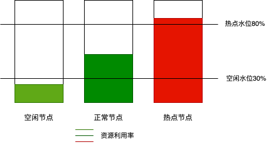

# 负载感知重调度

## 背景

集群中的调度是将 pending 状态的 Pod 分配到节点运行的过程, Pod 的调度依赖于集群中的调度器. 调度器是通过一系列算法计算出 Pod 运行的最佳节点, 但是 Kubernetes 集群环境是存在动态变化的, 例如某一个节点需要维护, 这个节点上的所有 Pod 会被驱逐到其他节点, 但是当维护完成后, 之前被驱逐的 Pod 并不会自动回到该节点上来, 因为 Pod 一旦被绑定了节点是不会触发重新调度的. 由于这些变化, 集群在一段时间之后就可能会出现不均衡的状态.

为了解决上述问题, Volcano 的重调度器可以根据设置的策略, 驱逐不符合配置策略的 Pod, 让其重新进行调度, 达到均衡集群负载、减少资源碎片化的目的. 项目地址: https://github.com/volcano-sh/descheduler.

## 功能

Volcano 的重调度能力在 https://github.com/kubernetes-sigs/descheduler.git 的基础上, 新增了以下功能:

### 支持按照 crontab 定时任务和固定时间间隔进行重调度

用户可以把 `Volcano descheduler` 部署为一个 Deploment 类型的工作负载. 然后在命令行参数指定按照 cronTab 定时运行或者固定时间间隔运行重调度组件, 而无需把重调度组件部署成一个 cronJob 类型的工作负载.

cronTab 定时任务: 指定参数 `--descheduling-interval-cron-expression='0 0 * * *'`, 表示每天凌晨运行一次重调度.

固定间隔: 指定参数 `--descheduling-interval=10m`, 表示每 10 分钟运行一次重调度.

请注意, `--descheduling-interval` 的优先级高于 `--descheduling-interval-cron-expression`, 当两个参数都设置时, descheduler 的行为以 `--descheduling-interva` 设置的为准.

### 支持基于真实负载感知的重调度 LoadAware

在 K8s 集群治理过程中, 常常会因 CPU、内存等高使用率状况而形成热点, 既影响了当前节点上 Pod 的稳定运行, 也会导致节点发生故障的几率的激增. 为了应对集群节负载不均衡等问题, 动态平衡各个节点之间的资源使用率, 需要基于节点的相关监控指标, 构建集群资源视图, 在集群治理阶段, 通过实时监控, 在观测到节点资源率较高、节点故障、Pod 数量较多等情况时, 可以自动干预, 迁移资源使用率高的节点上的一些 Pod 到利用率低的节点上.

原生的 descheduler 只支持基于 Pod request 的负载感知调度, 对利用率比较高的节点上的 Pods 进行驱逐, 从而均衡节点间的资源利用率, 避免个别节点过热. 但是 Pod request 并不能反映节点的真实资源使用情况, 因此 Volcano 实现了基于节点真实负载的重调度, 通过查询节点暴露的指标, 基于 CPU、Memory 的真实负载进行更加准确的重调度.



- 正常节点: 资源利用率大于等于 30% 且小于等于 80% 的节点. 此节点的负载水位区间是期望达到的合理区间范围.
- 热点节点: 资源利用率高于 80% 的节点. 热点节点将驱逐一部分 Pod, 降低负载水位, 使其不超过 80%. 重调度器会将热点节点上面的 Pod 调度到空闲节点上面.
- 空闲节点: 资源利用率低于 30% 的节点.

## 快速上手

### 准备

安装 prometheus 或者 prometheus-adaptor 和 prometheus-node-exporter, 节点的真实负载通过 node-exporter 和 prometheus 暴露给 `Volcano descheduler` 使用.

在 prometheus 的 `scrape_configs` 配置中添加如下的 node-exporter 服务的自动发现和节点标签替换规则, 这一步很重要, 否则 `Volcano descheduler` 拿不到节点的真实负载指标. 关于 scrape_configs 的更多细节请参考 [Configuration | Prometheus](https://prometheus.io/docs/prometheus/latest/configuration/configuration/#scrape_config).

```yaml
scrape_configs:
- job_name: 'kubernetes-service-endpoints'
  kubernetes_sd_configs:
  - role: endpoints
  relabel_configs:
  - source_labels: [__meta_kubernetes_pod_node_name]
    action: replace
    target_label: instance
```

### 安装 Volcano descheduler

#### 通过 yaml 安装

```bash
kubectl apply -f https://raw.githubusercontent.com/volcano-sh/descheduler/refs/heads/main/installer/volcano-descheduler-development.yaml
```

### 配置

默认的重调度配置在 volcano-system 命名空间下的 volcano-descheduler configMap 中, 你可以通过修改该 configMap 里的数据来更新重调度的配置. 或者在使用 helm 安装时增加参数 `--set custom.deschedulerPolicy=$CUSTOM_CONFIG` 来覆盖默认配置. 默认打开的插件为 `LoadAware` 和 `DefaultEvictor`, 分别进行基于负载感知的重调度和驱逐.

```yaml
apiVersion: "descheduler/v1alpha2"
kind: "DeschedulerPolicy"
profiles:
  - name: default
    pluginConfig:
      - args:
          ignorePvcPods: true
          nodeFit: true
          priorityThreshold:
            value: 10000
        name: DefaultEvictor
      - args:
          evictableNamespaces:
            exclude:
              - kube-system
          metrics:
            address: null
            type: null
          targetThresholds:
            cpu: 80 # 节点 cpu 利用率超过 80% 时会触发驱逐
            memory: 85 # 节点 memory 利用率超过 85% 时会触发驱逐
          thresholds:
            cpu: 30 # Pods 可以被调度到节点 cpu 资源利用低于 30% 的节点
            memory: 30 # Pods 可以被调度到节点 memory 资源利用低于 30% 的节点
        name: LoadAware
    plugins:
      balance:
        enabled:
          - LoadAware

```

`DefaultEvictor` 插件的全量配置和参数说明请参考: https://github.com/kubernetes-sigs/descheduler/tree/master#evictor-plugin-configuration-default-evictor.

LoadAware插件参数说明:

- 字段名称: nodeSelector
  类型: string
  默认值: nil
  说明: 只处理指定的节点, nil 表示处理所有节点

- 字段名称: evictableNamespaces
  类型: map(string:[]string)
  默认值: nil
  说明: 指定命名空间下 Pods 不会被驱逐

- 字段名称: nodeFit
  类型: bool
  默认值: false
  说明: 设置为 true 时, 调度器将在驱逐符合驱逐标准的 Pod 之前, 考虑这些 Pod 是否能在其他节点上运行.

- 字段名称: numberOfNodes
  类型: int
  默认值: 0
  说明: 该参数可以配置为仅在未充分利用节点的数量超过配置值时激活策略. 这对于节点可能频繁或短时间内未充分利用的大型集群来说, 可能会有所帮助.

- 字段名称: duration
  类型: string
  默认值: 2m
  说明: 查询节点实际利用率指标时指定的时间范围, 只有当 metrics.type 配置为 prometheus 生效.

- 字段名称: metrics
  类型: map(string:string)
  默认值: nil
  说明: 必填字段, 包含两个参数: type: 指标来源类型, 仅支持 prometheus 和 prometheus_adaptor, address: prometheus 服务地址.

- 字段名称: targetThresholds
  类型: map(string:int)
  默认值: nil
  说明: 必填字段, 支持配置的 key 为 cpu,memory,pods. 当节点资源 cpu 或 memory 利用率超过设置的阈值时, 会触发节点 Pods 驱逐, 单位为 %. 当节点 Pod 数量超过设置阈值时, 会触发节点 Pods 驱逐, 单位为个数.

- 字段名称: thresholds
  类型: map(string:int)
  默认值: nil
  说明: 必填字段, 被驱逐的 Pods 应该被调度到利用率低于 thresholds 的节点上. 同一种资源类型的阈值不能超过 targetThresholds 里设置的阈值.

除上述 LoadAware 插件增强功能外, `Volcano descheduler` 也支持原生 descheduler 的功能和插件, 如果要配置其他的原生插件, 请参考: [descheduler/docs/user-guide.md](https://github.com/kubernetes-sigs/descheduler/blob/master/docs/user-guide.md).

## 最佳实践

当资源利用率比较高的节点上的 Pods 被驱逐后, 我们期望新建的 Pods 应该避免再次被调度到资源利用率比较高的节点, 因此 Volcano 调度器也需要开启基于真实负载感知的调度插件 `usage`, 关于 `usage` 的详细说明和配置请参考: [volcano usage plugin](https://github.com/volcano-sh/volcano/blob/master/docs/design/usage-based-scheduling.md).

## 问题排查

当 LoadAware 插件的配置参数 metrics.type 设置为 `prometheus` 时, `Volcano scheduler` 通过以下 PromQL 语句查询 cpu 和 memory 的实际利用率, 当预期的驱驱逐行为没有发生时, 你可以通过 prometheus 查询节点的实际利用率, 排查节点指标是否正确暴露, 并可以对比 `Volcano descheduler` 的日志来判它的实际行为.

cpu:

```bash
avg_over_time((1 - (avg by (instance) (irate(node_cpu_seconds_total{mode="idle",instance="$replace_with_your_node_name"}[30s])) * 1))[2m:30s])
```

memory:

```bash
avg_over_time(((1-node_memory_MemAvailable_bytes{instance="$replace_with_your_node_name"}/node_memory_MemTotal_bytes{instance="$replace_with_your_node_name"}))[2m:30s])
```
